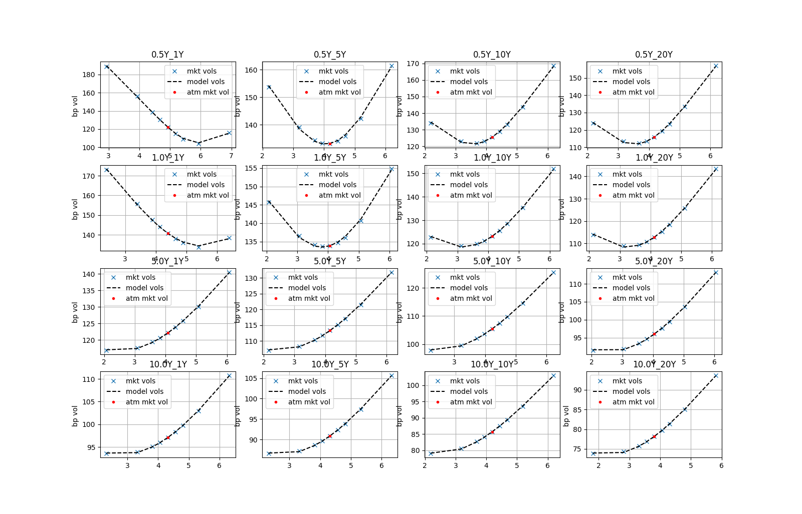
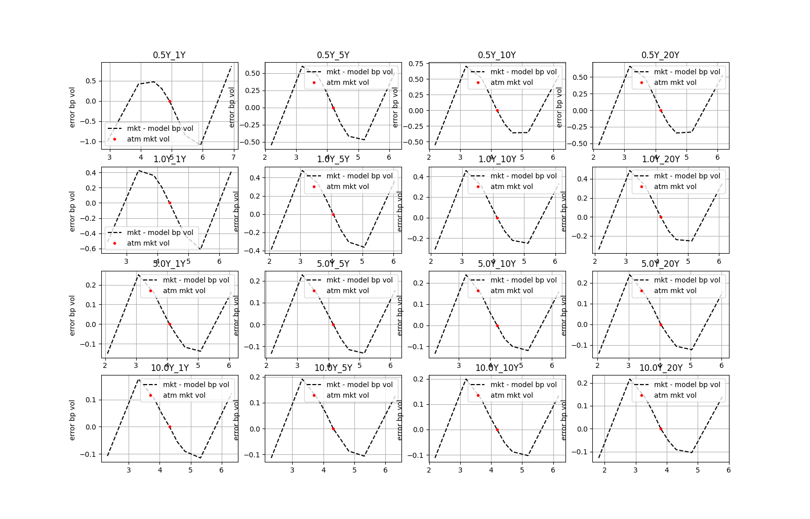

## Notebook: IR SABR calibration, results display and ir swaption pricing and risk

[This example notebook](./src/notebooks/ir_sabr_calibration.ipynb) builds ir curve , runs ir sabr calibrationan . Displays irvolcube calibration results and errors. Calculates the price and risk of 2 ir swaption examples

## IR SABR calibration results

## IR SABR calibration errors

## IR SABR project documentation

[This is IR SABR doc](./src/doc/IR%sabr.pdf) This note describes SABR model specification and IR swaption pricing and risk management